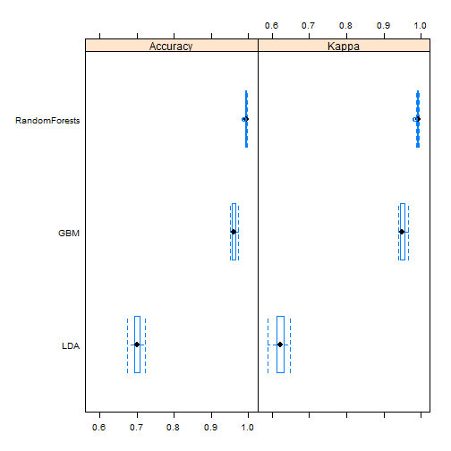

Practical Machine Learning Project
========================================================
## Summary
The purpose of this study is to predict the manner in which a set of users performed their exercises using wearable devices. After comparing the different models on the data, using Random Forests resulted in best accuracy. 

## Loading Data and libraries 


```r
library(caret)
```

```
## Warning: package 'caret' was built under R version 3.1.3
```

```
## Loading required package: lattice
## Loading required package: ggplot2
```

```r
library(parallel)
library(doParallel)
```

```
## Warning: package 'doParallel' was built under R version 3.1.3
```

```
## Loading required package: foreach
## Loading required package: iterators
```

```r
#User parallel processing to speed learning
cl=makeCluster(detectCores())
registerDoParallel(cl)

training = read.csv("pml-training.csv")
testing = read.csv("pml-testing.csv")
```

## Data Cleaning and Pre-Processing
After examining the data, there are several steps needed to clean the data. The exact same pre-processing is done on both the training and testing datasets. These steps include:

* Removing irrelavant features (the index x, the user name, the raw time stamps, new window and num window)
* Convert all features (except classe) to numeric
* Many features have null values. Hence, we need to remove all features that have more than 90% of NULL values. Note that when removing the features from testing, we used the same features with more than 90% NA in training


```r
#Remove irrelevant features
training = training[,-c(1:7)]
#Make classe the first feature for convenience
training = training[,c(153,1:152)]
#convert to numeric
training[,2:153] =as.data.frame(sapply(training[,-1],function(x){as.numeric(as.character(x))}))
#Remove NA values
PercNull<- colSums(1*is.na(training))/dim(training)[1]
training = training[,PercNull<0.9]

#Perform the exact same steps on testing
testing = testing[,-c(1:7)]
testing = testing[,c(153,1:152)]
testing[,2:153] =as.data.frame(sapply(testing[,-1],function(x){as.numeric(as.character(x))}))
testing = testing[,PercNull<0.9]
```

## Data Splitting and more pre-processing
To evaluate the performance of the models, we need to split the training data into training (70%) and validation (30%). The validation subset is used for out-of-sample accruacy. 

```r
set.seed(1234)
IDX = createDataPartition(y=training$classe,p=0.7,list=F)
train_set = training[IDX,]
valid_set = training[-IDX,]
```

Another preprocessing is needed to normalize the data. Again, we use the normalization results from the training subset to normalize the validation and the testing datasets. 


```r
NormalizeData = preProcess(train_set[,-1],method=c("center","scale"))

train_set[,2:53] = predict(NormalizeData,newdata=train_set[,-1])
valid_set[,2:53] = predict(NormalizeData,newdata=valid_set[,-1])
testing[,2:53]= predict(NormalizeData,newdata=testing[,-1])
```

## Building Models
We are going to use three different models: linear discriminat analysis, boosted trees and random forests. For each of these models we are going to use cross validation where K=3 and each is repeated 3 times. 

```r
set.seed(123)
#Setup cross validation controls
control <- trainControl(method="repeatedcv", number=10, repeats=3)

m_lda = train(classe~.,data=train_set,method="lda",trControl=control)
```

```
## Loading required package: MASS
```

```r
m_gbm = train(classe~.,data=train_set,method="gbm",trControl=control)
```

```
## Loading required package: gbm
```

```
## Warning: package 'gbm' was built under R version 3.1.3
```

```
## Loading required package: survival
## Loading required package: splines
## 
## Attaching package: 'survival'
## 
## The following object is masked from 'package:caret':
## 
##     cluster
## 
## Loaded gbm 2.1.1
## Loading required package: plyr
```

```
## Iter   TrainDeviance   ValidDeviance   StepSize   Improve
##      1        1.6094             nan     0.1000    0.2390
##      2        1.4570             nan     0.1000    0.1612
##      3        1.3557             nan     0.1000    0.1278
##      4        1.2747             nan     0.1000    0.1102
##      5        1.2070             nan     0.1000    0.0918
##      6        1.1498             nan     0.1000    0.0802
##      7        1.0981             nan     0.1000    0.0657
##      8        1.0568             nan     0.1000    0.0591
##      9        1.0198             nan     0.1000    0.0520
##     10        0.9873             nan     0.1000    0.0526
##     20        0.7544             nan     0.1000    0.0253
##     40        0.5311             nan     0.1000    0.0113
##     60        0.4069             nan     0.1000    0.0077
##     80        0.3293             nan     0.1000    0.0041
##    100        0.2710             nan     0.1000    0.0023
##    120        0.2281             nan     0.1000    0.0028
##    140        0.1925             nan     0.1000    0.0024
##    150        0.1785             nan     0.1000    0.0012
```

```r
m_rf = train(classe~.,data=train_set,method="rf",trControl=control)
```

```
## Loading required package: randomForest
```

```
## Warning: package 'randomForest' was built under R version 3.1.1
```

```
## randomForest 4.6-10
## Type rfNews() to see new features/changes/bug fixes.
```

## Model Accuracy
Since we used cross validation, then we have 10 different accuracy results for each model. To compare the results, we can plot them using a box-plot. The results show that Random Forests has the best total accuracy. 


```r
result=resamples(list(LDA=m_lda,RandomForests=m_rf,GBM=m_gbm))
bwplot(result)
```

 

## Out-of-Sample Accuracy
To test the accuracy using the validation subsample, we simply calculate the predicted values and print the confusion matrix. Again, the results show that Random Forests has the best accuracy. 


```r
lda_accuracy<- predict(m_lda, valid_set)
print(confusionMatrix(lda_accuracy, valid_set$classe))
```

```
## Confusion Matrix and Statistics
## 
##           Reference
## Prediction    A    B    C    D    E
##          A 1371  177   91   63   46
##          B   38  735   98   38  192
##          C  146  138  683  114   94
##          D  116   42  126  719  110
##          E    3   47   28   30  640
## 
## Overall Statistics
##                                          
##                Accuracy : 0.7048         
##                  95% CI : (0.693, 0.7165)
##     No Information Rate : 0.2845         
##     P-Value [Acc > NIR] : < 2.2e-16      
##                                          
##                   Kappa : 0.6265         
##  Mcnemar's Test P-Value : < 2.2e-16      
## 
## Statistics by Class:
## 
##                      Class: A Class: B Class: C Class: D Class: E
## Sensitivity            0.8190   0.6453   0.6657   0.7459   0.5915
## Specificity            0.9105   0.9229   0.8987   0.9199   0.9775
## Pos Pred Value         0.7843   0.6676   0.5813   0.6460   0.8556
## Neg Pred Value         0.9268   0.9156   0.9272   0.9487   0.9140
## Prevalence             0.2845   0.1935   0.1743   0.1638   0.1839
## Detection Rate         0.2330   0.1249   0.1161   0.1222   0.1088
## Detection Prevalence   0.2970   0.1871   0.1997   0.1891   0.1271
## Balanced Accuracy      0.8647   0.7841   0.7822   0.8329   0.7845
```

```r
gbm_accuracy<- predict(m_gbm, valid_set)
print(confusionMatrix(gbm_accuracy, valid_set$classe))
```

```
## Confusion Matrix and Statistics
## 
##           Reference
## Prediction    A    B    C    D    E
##          A 1653   43    0    0    1
##          B   15 1060   30    9    8
##          C    2   30  982   22   17
##          D    2    5   12  927   13
##          E    2    1    2    6 1043
## 
## Overall Statistics
##                                           
##                Accuracy : 0.9626          
##                  95% CI : (0.9575, 0.9673)
##     No Information Rate : 0.2845          
##     P-Value [Acc > NIR] : < 2.2e-16       
##                                           
##                   Kappa : 0.9527          
##  Mcnemar's Test P-Value : 8.138e-06       
## 
## Statistics by Class:
## 
##                      Class: A Class: B Class: C Class: D Class: E
## Sensitivity            0.9875   0.9306   0.9571   0.9616   0.9640
## Specificity            0.9896   0.9869   0.9854   0.9935   0.9977
## Pos Pred Value         0.9741   0.9447   0.9326   0.9666   0.9896
## Neg Pred Value         0.9950   0.9834   0.9909   0.9925   0.9919
## Prevalence             0.2845   0.1935   0.1743   0.1638   0.1839
## Detection Rate         0.2809   0.1801   0.1669   0.1575   0.1772
## Detection Prevalence   0.2884   0.1907   0.1789   0.1630   0.1791
## Balanced Accuracy      0.9885   0.9588   0.9713   0.9776   0.9808
```

```r
rf_accuracy<- predict(m_rf, valid_set)
print(confusionMatrix(rf_accuracy, valid_set$classe))
```

```
## Confusion Matrix and Statistics
## 
##           Reference
## Prediction    A    B    C    D    E
##          A 1674    8    0    0    0
##          B    0 1130    4    2    1
##          C    0    1 1018    6    2
##          D    0    0    4  955    3
##          E    0    0    0    1 1076
## 
## Overall Statistics
##                                           
##                Accuracy : 0.9946          
##                  95% CI : (0.9923, 0.9963)
##     No Information Rate : 0.2845          
##     P-Value [Acc > NIR] : < 2.2e-16       
##                                           
##                   Kappa : 0.9931          
##  Mcnemar's Test P-Value : NA              
## 
## Statistics by Class:
## 
##                      Class: A Class: B Class: C Class: D Class: E
## Sensitivity            1.0000   0.9921   0.9922   0.9907   0.9945
## Specificity            0.9981   0.9985   0.9981   0.9986   0.9998
## Pos Pred Value         0.9952   0.9938   0.9912   0.9927   0.9991
## Neg Pred Value         1.0000   0.9981   0.9984   0.9982   0.9988
## Prevalence             0.2845   0.1935   0.1743   0.1638   0.1839
## Detection Rate         0.2845   0.1920   0.1730   0.1623   0.1828
## Detection Prevalence   0.2858   0.1932   0.1745   0.1635   0.1830
## Balanced Accuracy      0.9991   0.9953   0.9952   0.9946   0.9971
```

## Predicting the testing dataset
Finally, we use the best model (Random Forests) to predict the testing dataset

```r
pml_write_files = function(x){
  n = length(x)
  for(i in 1:n){
    filename = paste0("problem_id_",i,".txt")
    write.table(x[i],file=filename,quote=FALSE,row.names=FALSE,col.names=FALSE)
  }
}
pml_write_files(predict(m_rf, testing))
```
